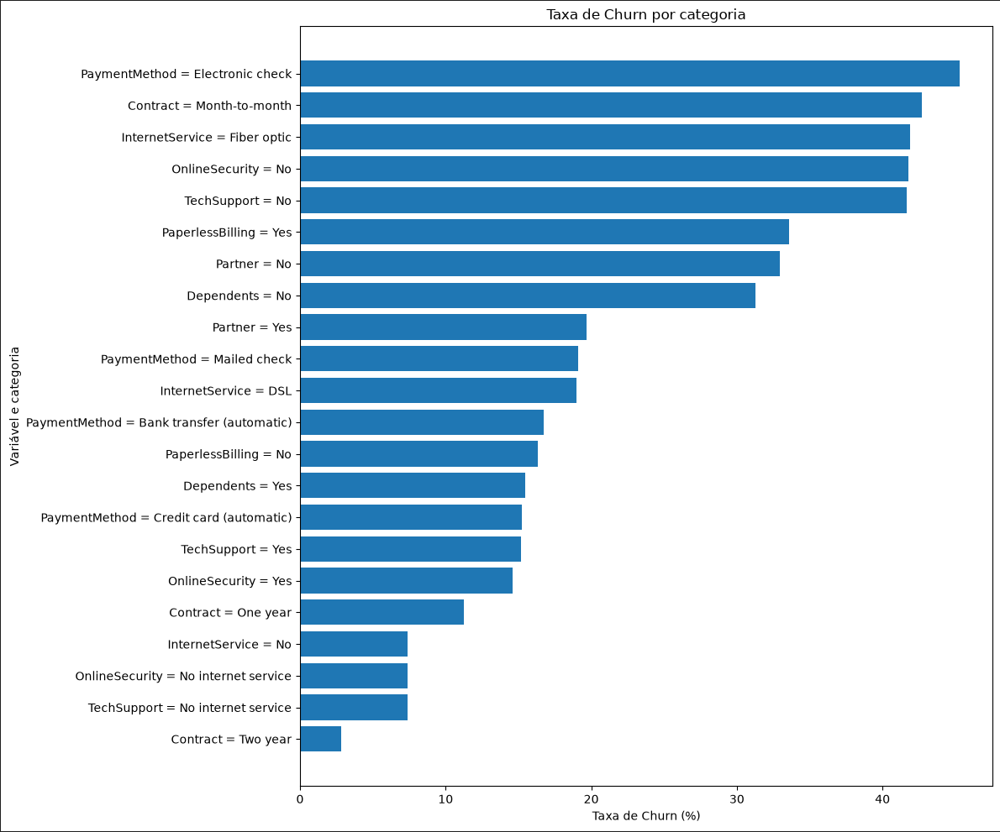
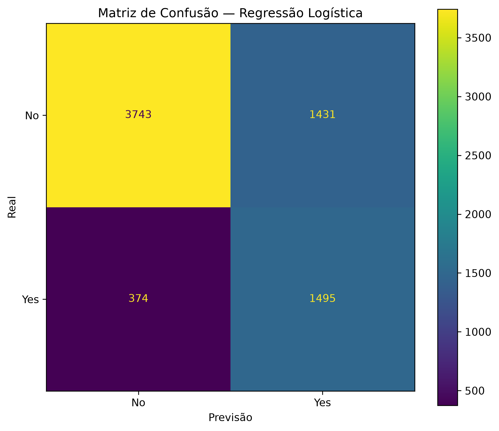
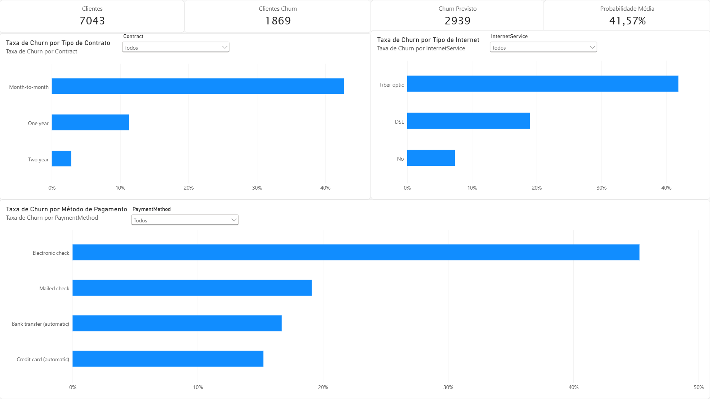
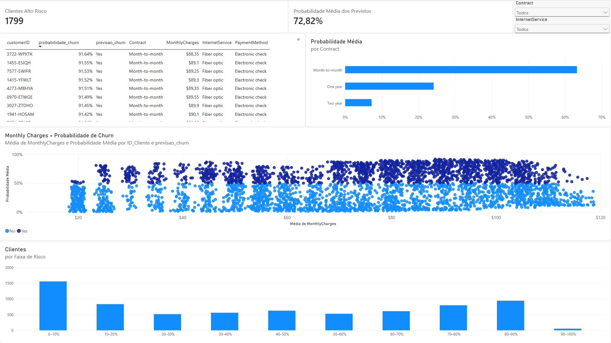
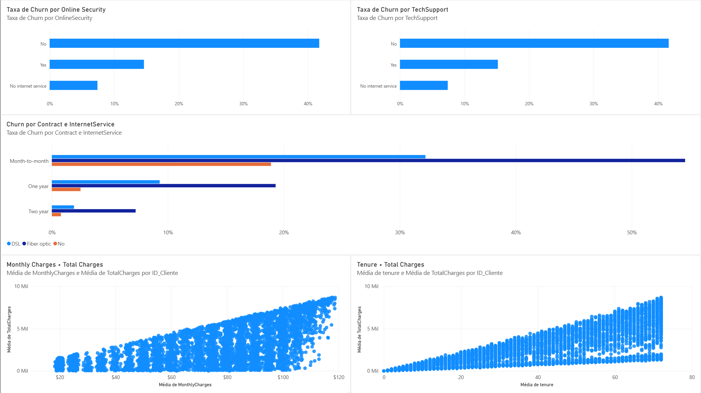

# Classificador de Churn

Projeto de análise e previsão de **churn de clientes**, desenvolvido durante meus estudos em **Engenharia da Computação**, com foco em desenvolvimento, Machine Learning e, ao longo do projeto, também em **estatística aplicada à análise de dados**.

A ideia não foi apenas treinar um modelo para prever churn, mas entender o problema antes da modelagem, investigar as relações entre as variáveis e usar essas análises para tomar decisões durante o desenvolvimento do modelo.

## Objetivo

O objetivo do projeto é identificar clientes com maior probabilidade de cancelar um serviço (**churn**) a partir de informações sobre perfil, contrato, serviços utilizados e cobrança.

Além da previsão, o projeto busca responder perguntas como:

- Quais características estão mais associadas ao churn?
- Existem variáveis com informações muito semelhantes entre si?
- Como as variáveis numéricas se relacionam?
- Qual modelo apresenta um comportamento mais adequado para esse problema?

## Dataset

Foi utilizado o dataset [**Telco Customer Churn**](https://www.kaggle.com/datasets/blastchar/telco-customer-churn), disponibilizado no Kaggle.

A base possui:

- **7.043 clientes**;
- **20 variáveis utilizadas na modelagem**;
- variável alvo: `Churn`;
- aproximadamente **26,5% dos clientes em churn**.

Como o dataset possui uma quantidade bem maior de clientes sem churn, o problema apresenta certo **desbalanceamento de classes**.

Durante o tratamento inicial dos dados, a coluna `TotalCharges` apresentou alguns valores vazios. Esses registros correspondiam a clientes com `tenure = 0` e `Churn = No`, então os valores foram tratados como `0`.

Também foram verificadas duplicidades e valores ausentes após o tratamento.

## Análise exploratória

Antes de treinar os modelos, foi feita uma análise exploratória para entender melhor o comportamento dos dados.

Entre as diferenças encontradas, alguns exemplos foram:

- clientes com contratos `Month-to-month` apresentaram uma taxa de churn bem maior que clientes com contratos de um ou dois anos;
- `Electronic check` apresentou uma taxa de churn maior entre os métodos de pagamento;
- clientes com `Fiber optic` apresentaram uma taxa de churn maior que clientes com `DSL` ou sem serviço de internet;
- variáveis como `OnlineSecurity` e `TechSupport` também apresentaram diferenças importantes entre os grupos.

Essa etapa foi importante para entender o problema antes de partir para a modelagem.

## Estatística aplicada

Como parte do desenvolvimento, também utilizei o projeto para estudar e aplicar alguns conceitos de estatística.

Para variáveis numéricas, foram utilizados testes **Mann-Whitney** para comparar as distribuições entre clientes com e sem churn.

Foram analisadas principalmente:

- `tenure`;
- `MonthlyCharges`;
- `TotalCharges`.

Também foram utilizados testes de **qui-quadrado de independência** e **Cramér's V** para investigar associações entre variáveis categóricas e `Churn`.

Algumas das variáveis que apresentaram associações mais relevantes com churn foram:

- `Contract`;
- `OnlineSecurity`;
- `TechSupport`;
- `InternetService`;
- `PaymentMethod`.

A ideia nessa etapa não foi apenas executar os testes, mas entender o que eles estavam indicando e usar essas informações junto com a análise exploratória e a modelagem.

## Seleção de atributos

Depois da análise inicial, foi feita uma investigação para verificar se algumas variáveis poderiam ser redundantes.

Foram analisadas:

- correlações entre variáveis numéricas;
- associação entre variáveis categóricas;
- associação das variáveis com `Churn`.

Entre as correlações numéricas, um dos principais resultados foi:

- `tenure` × `TotalCharges`: **0,83**;
- `MonthlyCharges` × `TotalCharges`: **0,65**.

Também foram encontradas associações fortes entre alguns grupos de variáveis categóricas.

Mesmo assim, nem toda associação forte significava que uma variável deveria ser removida. Por isso, parte das decisões foi testada diretamente durante a modelagem.

No final, algumas variáveis com pouca contribuição para o modelo foram removidas, resultando na configuração utilizada pela regressão logística final:

- `gender`;
- `PhoneService`;
- `MultipleLines`;
- `Partner`;
- `SeniorCitizen`;
- `Dependents`;
- `PaperlessBilling`.

## Investigação de multicolinearidade

Uma das partes que achei mais interessante durante o desenvolvimento foi investigar como variáveis correlacionadas poderiam afetar os coeficientes da regressão logística.

Por exemplo, `tenure` possui uma correlação forte com `TotalCharges`. Quando essas variáveis são analisadas separadamente, os coeficientes apresentam determinados comportamentos. Quando são colocadas juntas no modelo, os coeficientes mudam.

Isso ajudou a entender na prática uma diferença importante entre:

- a relação de uma variável com o alvo quando analisada isoladamente;
- o efeito do mesmo atributo dentro de um modelo que considera várias variáveis ao mesmo tempo.

Essa análise está documentada no arquivo `analise_multicolinearidade.py`.

A análise foi utilizada para entender o comportamento do modelo e não para estabelecer relações causais.

## Modelagem

Foram comparados dois modelos:

- **Regressão Logística**;
- **Random Forest**.

O pré-processamento foi feito com:

- `StandardScaler` para variáveis numéricas;
- `OneHotEncoder` para variáveis categóricas;
- `handle_unknown = "ignore"` para categorias não observadas durante o treinamento.

A validação utilizou **StratifiedKFold com 5 folds**, preservando a proporção das classes em cada fold.

Também foram testados diferentes hiperparâmetros e configurações de atributos.

### Modelo final

A configuração escolhida para gerar as previsões foi uma **Regressão Logística** com:

- `C = 1`;
- `class_weight = "balanced"`;
- `max_iter = 1000`;
- threshold de classificação = **0,50**.

O uso de `class_weight = "balanced"` e a escolha do threshold levaram em consideração a prioridade de identificar clientes em risco de churn, dando maior importância ao **Recall** da classe `Yes`.

## Threshold

Além do treinamento do modelo, também foi analisado o efeito do **threshold de classificação**.

A regressão logística gera uma probabilidade para cada cliente. Essa probabilidade precisa ser convertida em uma classe (`Yes` ou `No`) usando um limite.

Foram testados thresholds entre `0,30` e `0,70`.

Com thresholds menores, o modelo identifica mais clientes como possíveis churns, aumentando o recall, mas também aumentando a quantidade de falsos positivos.

O threshold de **0,50** foi escolhido para a configuração final, mantendo um recall alto sem aumentar excessivamente a quantidade de falsos positivos.

## Avaliação final

As métricas finais foram calculadas usando **predições out-of-fold em validação cruzada estratificada com 5 folds**.

| Métrica | Resultado |
|---|---:|
| Accuracy | **74,37%** |
| Precision | **51,09%** |
| Recall | **79,99%** |
| F1-score | **62,36%** |
| ROC-AUC | **84,26%** |

A matriz de confusão final foi:

| | Previsto: No | Previsto: Yes |
|---|---:|---:|
| **Real: No** | 3743 | 1431 |
| **Real: Yes** | 374 | 1495 |

### Interpretação

O modelo apresentou **Recall de 79,99%** para churn. Isso significa que, dentro da avaliação final, a maior parte dos clientes que realmente cancelaram foi identificada pelo modelo.

Ao mesmo tempo, a **Precision de 51,09%** mostra que existe uma quantidade relevante de falsos positivos. Esse comportamento é compatível com a decisão de priorizar o Recall em um problema em que deixar clientes em risco sem identificação pode ser mais relevante do que minimizar todos os alertas.

> **Observação:** essas métricas representam uma estimativa obtida por validação cruzada. Como a mesma base foi utilizada durante o processo de experimentação e escolha da configuração final, uma avaliação completamente independente, como um novo holdout externo ou nested cross-validation, seria necessária para uma estimativa mais rigorosa de generalização.

## Geração das previsões

Depois de definir o modelo final, ele foi treinado utilizando os **7.043 clientes** da base para gerar as previsões utilizadas no Power BI.

Para cada cliente foram geradas, entre outras informações:

- `customerID`;
- dados originais do cliente;
- `probabilidade_churn`;
- `previsao_churn`.

Com threshold de **0,50**, o modelo classificou:

- **2.939 clientes** como `Yes`;
- **4.104 clientes** como `No`.

A base final foi salva em `data/processed/previsoes_churn.csv` e utilizada como fonte para o dashboard no Power BI.

## Power BI

Depois da etapa de Machine Learning, as previsões foram utilizadas para criar um dashboard com três páginas.

### Visão Geral do Churn

Apresenta uma visão geral da base, incluindo:

- quantidade total de clientes;
- churn real;
- churn previsto pelo modelo;
- probabilidade média de churn;
- taxa de churn por tipo de contrato;
- taxa de churn por tipo de internet;
- taxa de churn por método de pagamento.

### Perfil de Risco

Essa página é focada diretamente nas previsões do modelo.

São apresentados:

- clientes classificados como alto risco;
- probabilidade média entre os clientes previstos como churn;
- distribuição das probabilidades de churn;
- probabilidade média por tipo de contrato;
- relação entre `MonthlyCharges` e probabilidade de churn;
- tabela com os clientes de maior risco.

### Fatores Associados ao Churn

A terceira página reúne algumas das análises feitas durante o estudo dos dados, permitindo observar associações entre características dos clientes e churn.

Entre as análises estão:

- `OnlineSecurity`;
- `TechSupport`;
- `Contract`;
- `InternetService`;
- `MonthlyCharges`;
- `TotalCharges`;
- `tenure`.

Também foram utilizadas visualizações de dispersão para observar relações entre variáveis numéricas.

## O que eu aprendi com o projeto

Esse projeto acabou sendo mais do que apenas um exercício de classificação.

Além de praticar Python, scikit-learn e construção de modelos, usei o projeto para estudar melhor conceitos de **estatística aplicada**, principalmente na interpretação de distribuições, testes de hipótese, associação entre variáveis, correlação e multicolinearidade.

Uma das principais coisas que levei desse processo foi perceber que a parte mais importante nem sempre é escolher o algoritmo. Entender os dados, questionar os resultados e justificar as decisões de modelagem também faz parte do desenvolvimento de um modelo.

## Tecnologias

- Python
- Pandas
- NumPy
- Scikit-learn
- Matplotlib
- Seaborn
- Jupyter Notebook
- Power BI
- Git / GitHub
