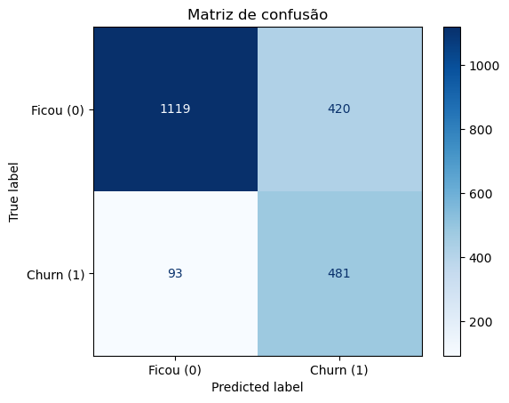
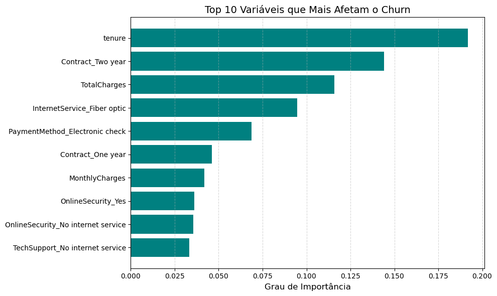

# Customer Churn Prediction (Telecom)

Machine Learning model to predict whether a telecommunications company's customer will cancel the service (churn), with a comparison between two classification algorithms.

## Objective

The goal of this project was to put into practice, end-to-end, Machine Learning knowledge using Scikit-Learn: from data cleaning and preparation to training, evaluation, and comparison of different classification models — analyzing not just which model "gets more right," but which one actually solves the business problem better.

## Dataset

The data used comes from the [Telco Customer Churn](https://www.kaggle.com/datasets/blastchar/telco-customer-churn) dataset, publicly available on Kaggle. It contains real (anonymized) data from telecom customers, including demographic information, contract type, subscribed services, and whether the customer canceled the service or not.

> The CSV file is not included in this repository. To reproduce the project, download the dataset from the link above and save it as `WA_Fn-UseC_-Telco-Customer-Churn.csv` in the project root.

## Methodology

### 1. Data preparation
- Handling of the `TotalCharges` column, which contained inconsistent values (empty strings) and was converted to numeric, filling invalid cases with 0.
- Encoding of categorical variables:
  - **Label Encoding** for binary columns (`gender`, `Partner`, `Dependents`, `PhoneService`, `PaperlessBilling`).
  - **One-Hot Encoding** for columns with multiple categories (`Contract`, `InternetService`, `PaymentMethod`, among others).
- Standardization (`StandardScaler`) of numeric variables (`tenure`, `MonthlyCharges`, `TotalCharges`), fitted only on the training data and applied to the test data, to avoid data leakage.
- Train/test split using `train_test_split` (70/30, `random_state=42` for reproducibility).

### 2. Class balancing
The dataset is imbalanced: most customers do not cancel the service. This means a "naive" model could achieve high overall accuracy just by predicting "won't cancel" most of the time — which is useless in practice, since the goal is precisely to identify who will cancel.

To address this, both models were trained with the `class_weight='balanced'` parameter. Instead of duplicating or generating new data, this technique internally adjusts the model's loss function, penalizing errors on the minority class (customers who churn) more heavily. The result was a significant gain in **recall** for the churn class, at the cost of some precision — an acceptable and even desirable trade-off in this type of problem, where missing a customer who will churn (false negative) tends to be more costly for the business than predicting a cancellation that doesn't happen (false positive).

### 3. Trained models
Two models were trained and compared:
- **Logistic Regression**
- **Random Forest Classifier**

For the Random Forest, the `max_depth` hyperparameter was tuned empirically. Higher and lower tree depth values were tested; high values led to overfitting (the model memorized patterns from the training set that did not generalize well to the test set), while values that were too low lost the ability to capture relevant relationships in the data. The value `max_depth=5` showed the best balance between generalization and performance during testing, and was the one adopted in the final version.

## Results

| Metric (Churn class) | Logistic Regression | Random Forest |
|---|---|---|
| Overall accuracy | 75.72% | 75.06% |
| Precision | 0.53 | 0.53 |
| Recall | 0.84 | 0.84 |
| F1-score | 0.65 | 0.65 |

Full classification report:

**Logistic Regression**
```
              precision    recall  f1-score   support
           0       0.92      0.73      0.81      1539
           1       0.53      0.84      0.65       574
    accuracy                           0.76      2113
   macro avg       0.73      0.78      0.73      2113
weighted avg       0.82      0.76      0.77      2113
```

**Random Forest**
```
              precision    recall  f1-score   support
           0       0.92      0.72      0.81      1539
           1       0.53      0.84      0.65       574
    accuracy                           0.75      2113
   macro avg       0.73      0.78      0.73      2113
weighted avg       0.82      0.75      0.76      2113
```

### Confusion matrix (Logistic Regression)



Of the 574 customers who actually canceled the service in the test set, the model correctly identified 481 (84% recall), missing only 93 cases. On the other hand, 420 customers who did not cancel were classified as potential churn (false positives) — an expected and acceptable result given the balancing applied, since the focus of the project was to prioritize identifying at-risk customers.

### Feature importance (Random Forest)



## Key Insights

- **`tenure` (contract length) is the most relevant variable** for predicting churn, followed by two-year contracts (`Contract_Two year`) and the total amount already paid (`TotalCharges`). This indicates that newer customers, without a long-term commitment, are the highest-risk group.
- Customers with **fiber optic internet** and who pay via **electronic check** also rank among the most influential variables, suggesting specific customer profiles with a higher propensity to cancel.
- Both models showed **nearly identical precision and recall for the churn class** (0.53 / 0.84), differing only in overall accuracy. This shows that, in this problem, class balancing had as much impact as (or more than) the choice of algorithm itself — and that a simpler model (Logistic Regression) performed equivalently to a more complex one (Random Forest).

## Technologies used

- Python
- Pandas
- Scikit-Learn
- Matplotlib

## How to run

```bash
pip install -r requirements.txt
python classificador.py
```

> Make sure you have downloaded the dataset from Kaggle and saved it as `WA_Fn-UseC_-Telco-Customer-Churn.csv` in the project root before running the script.